# Quality of Life Index - Portfolio Project 3

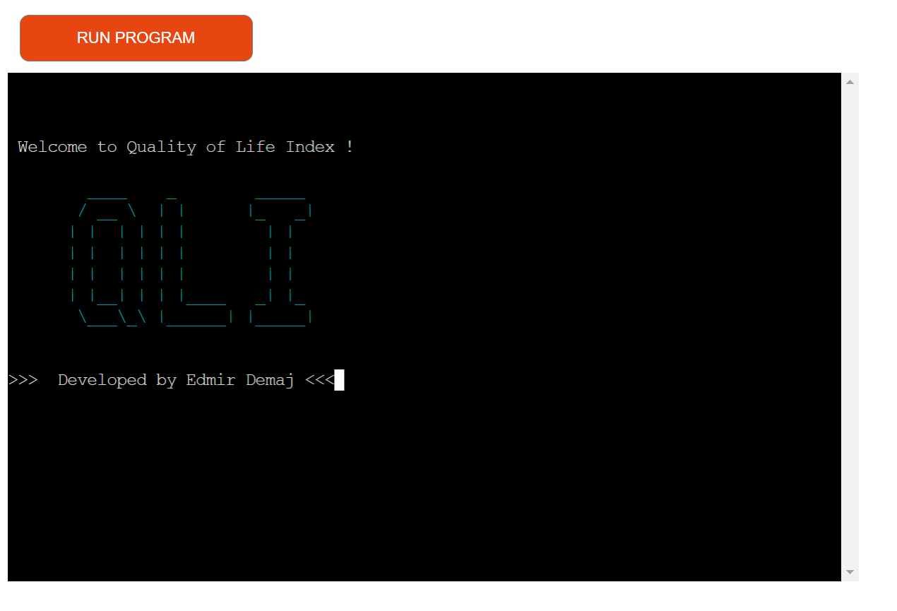

## [Link to live web application](https://quality-life-index.herokuapp.com/)
---
## Project Documentation
### Welcome to [Quality of Life Index](https://quality-life-index.herokuapp.com/)

Quality of Life Index is an application built as part of Code Institute Full Stack Development course. It is built using Python3 programming language and some libraries to expand functionality of the app.

The present documentation will provide information to understanding the core design principles that enabled the development of the project. More specifically, details regarding the UX/UI development, application testing and deployment, bug fixes and the planned future features for the project.

---

## Table of Contents

-   [The Story](#the-story)

-   [User Experience (UX)](#user-experience-ux)
    -   [Target Audiance](#target-audiance)
    -   [Objectives](#objectives)
    -   [User Stories](#user-stories)
    -   [Colour Palette](#colour-palette)

- [Technical Design](#technical-design)
    -   [Flowchart](#flowchart)
    -   [Data Model](#data-model)

-   [Website Features](#website-features)
    -   [Application Elements](#application-elements)

-   [Future Features](#future-features) 

-   [Testing & Validation](#testing--validation)

-   [Bug Fixes](#bugs)

-   [Deployment](#deployment)

-   [Technologies Used](#technologies-used)
    -   [Libraries](#libraries)

-   [Credits and References](#credits-and-references)

-   [Acknowledgements](#acknowledgements)

---

## The Story
The idea of this application is to provide to user the Quality of Life Index
for different Countries in World. Quality of Life Index (higher is better) is an estimation of overall quality of life by using an empirical formula which takes into account purchasing power index (higher is better), pollution index (lower is better), house price to income ratio (lower is better), cost of living index (lower is better), safety index (higher is better), health care index (higher is better), traffic commute time index (lower is better) and climate index (higher is better). 

Using this application would make possible to access any data available faster and repeatedly so user can have an idea how is the life in specific Countries if they want to know just for curiosity or if they would like to relocate to another Country.

---

## User Experience (UX)

### Target Audiance

This project targets general audience inclusicve all ages starting from teenagers.
It is not useful for kids.

### Objectives

- Experience an enjoyable Quality of Life Index application.
- Provide information what is about the application.
- Personalize app with user name.
- Possibility to select between Continents worldwide.
- Possibility to select a Country from that Continent to get QLI.
- Provide more specific data about QLI.
- Select another Continent or Country.

### User Stories

-   As a user, I want to be presented with a clear welcome section or logo.
-   As a user, I want to understand what is Quality of Life Index.
-   As a user, I want to understand what takes on consideration this Index when is calculated.
-   As a user, I want to be presented with questions that are clear and concise.
-   As a user, I want to understand how to insert input values.
-   As a user, I want to understand what is wrong with my input value.
-   As a user, I want to be able to provide a username.
-   As a user, I want to be able to select one of the Continents in World.
-   As a user, I want to be able to select one of the Countries from this Continent.
-   As a user, I want to know if the app has no data for my Country selected.
-   As a user, I want to have a clear detailed infromation about Quality of Life Index.
-   As a user, I want to be asked if I want to reselect again another Country before the application terminates.

### Colour Palette

[Coolors](https://coolors.co/) is a website which generates colours palette. Using this colour palette has high contrast colours and the colours are used for giving meaning as below:
- Green when input values are correct from user.
- Red when input values are wrong from user.
- Yellow informative and illustrative messages.
- Cyan to focus Continents and Country names.
- White informative text lines.

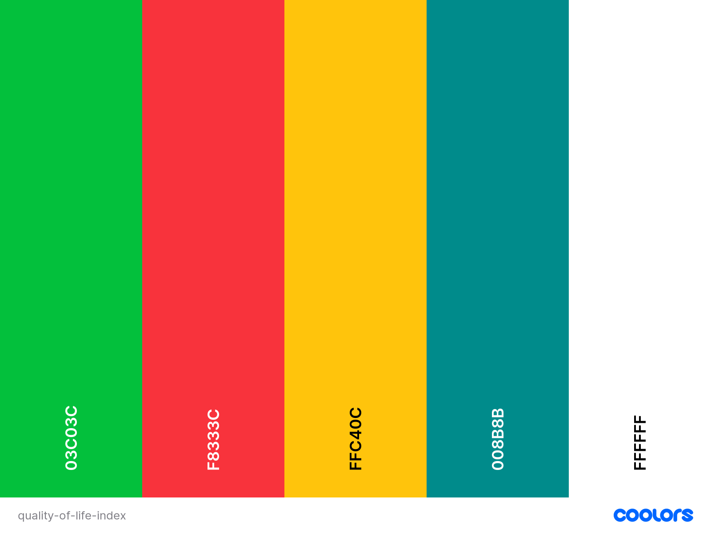

---

## Technical Design

### Flowchart

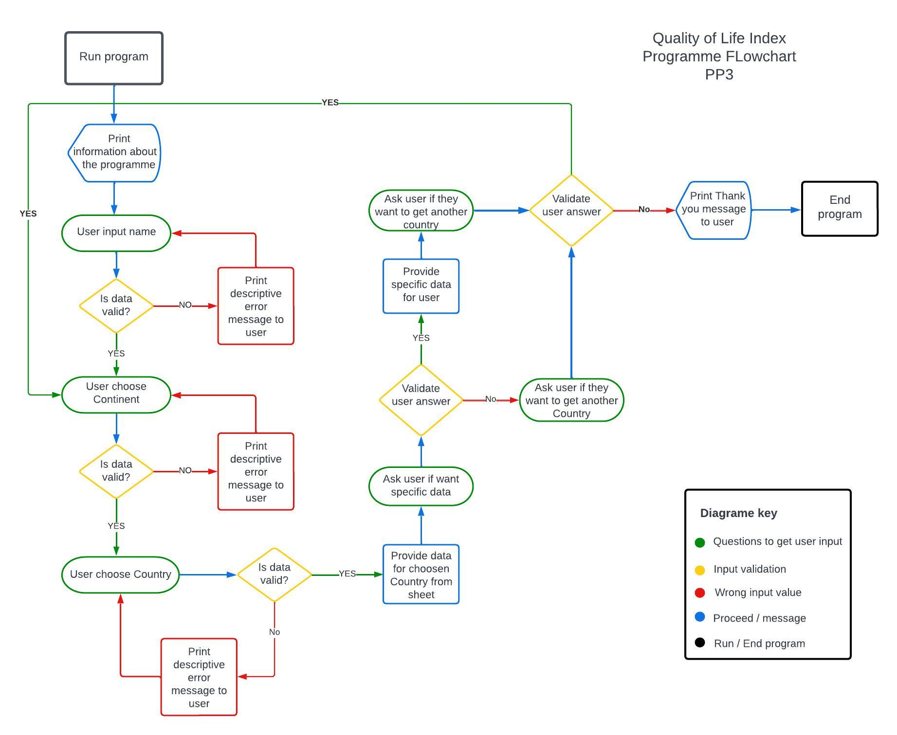

### Data Model
The data model used for this application is manipulating data stored on Google Cloud platform (Google sheets) with Python3 functions. This data is accessed using Python Libraries like google oauth2 and gspread. 
Using Python3 functions i get user input value, validate it and based on this value access google sheet. From there i show to user data using another function.
A Class named TextStyle is created on style.py file to allow access to various colours with shortcuts that are specific to each colour. Colours are imported from Colorama library are shortened and made easy to access from this Class when needed in the application.

Access-sheet Function model

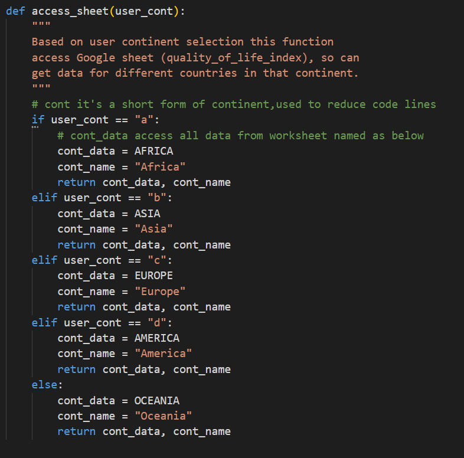

Class model TextStyle

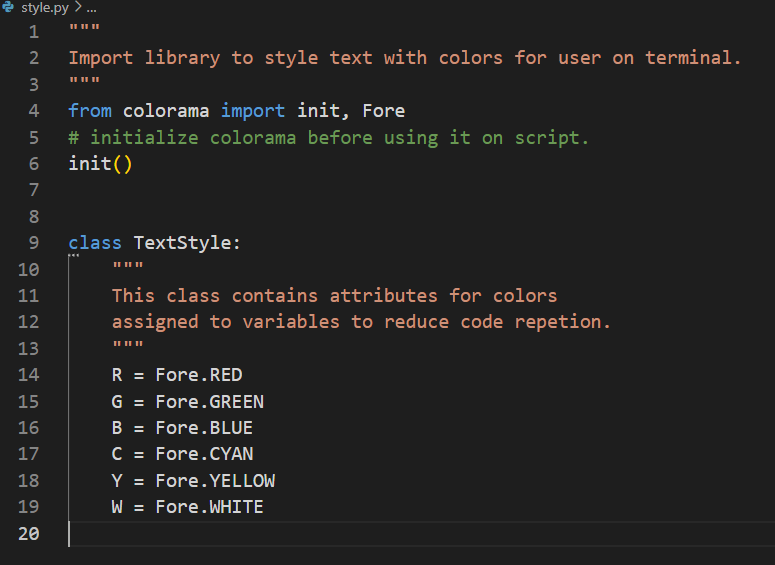

---
Google sheet data
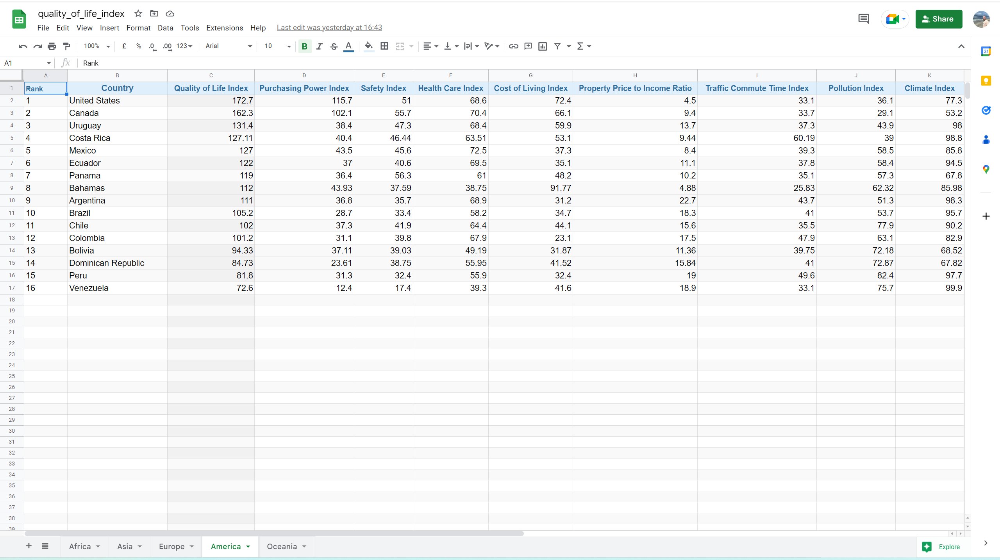

---

## Website Features

The design considerations are impacted as this application is a CLI-based.
Priority for this app and what was taken in consideration during the development is funcionality. Making sure all its features are working providing the desirable results for user and developer.

### Application Elements

The below elements are available to be experienced by the user while running this app.

#### Welcome Logo

#### App Info

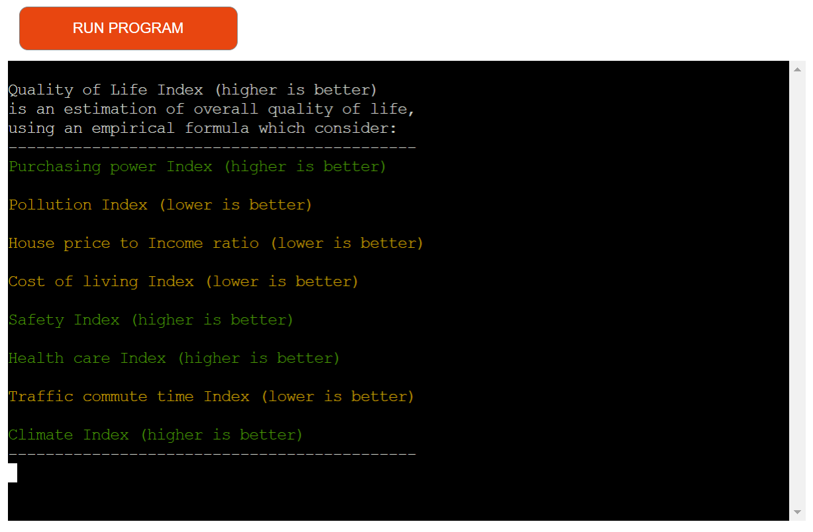

#### Username input instructions & answer feedback

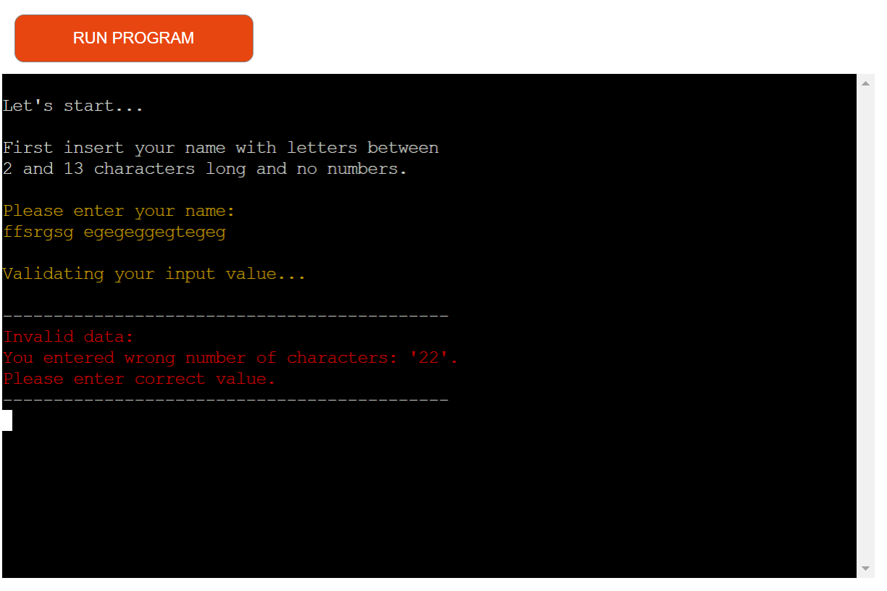

#### Select Continent to get data

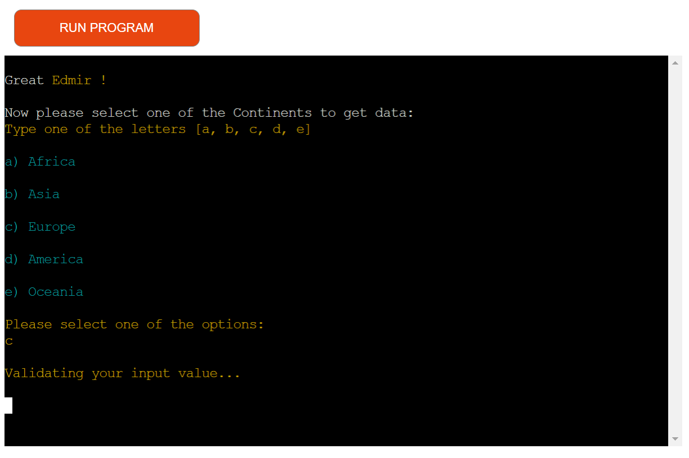

#### Select Country to get data for & user input feedback

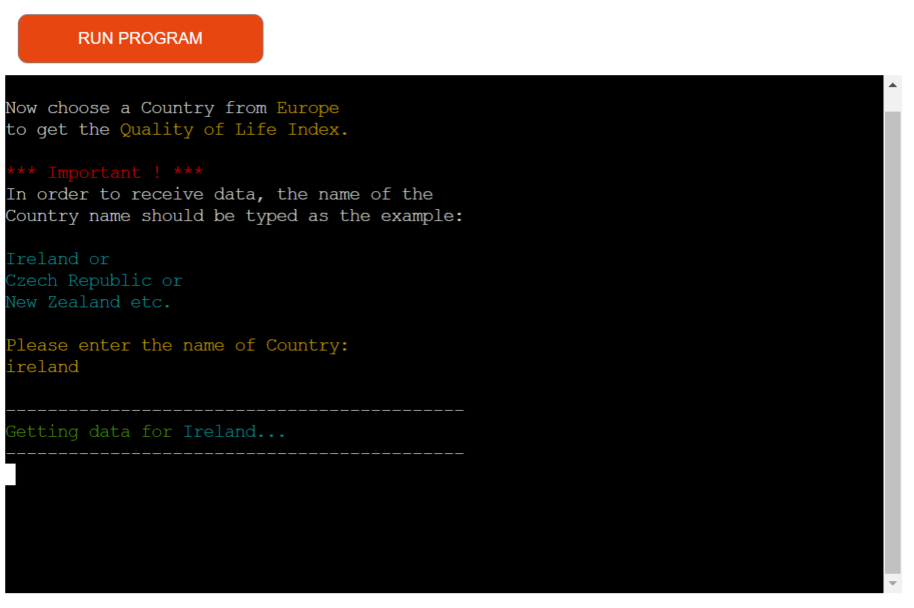

#### Show Quality of Life Index for Country selected

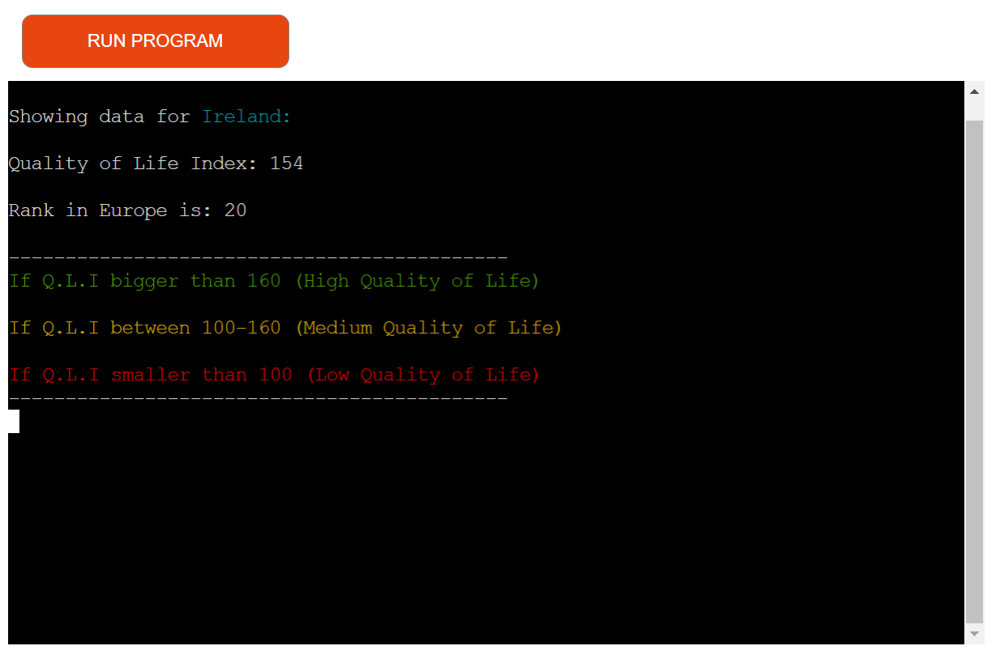

#### Ask user if they want specific data & answer input feedback

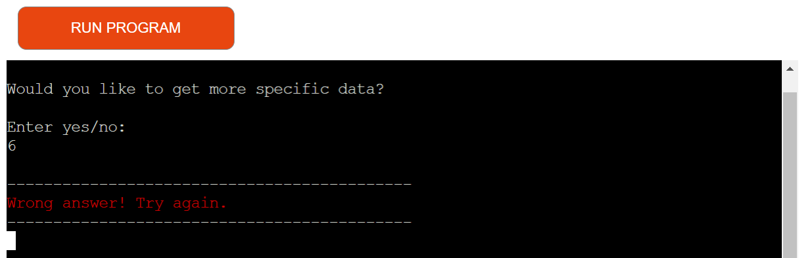

#### Show specific data

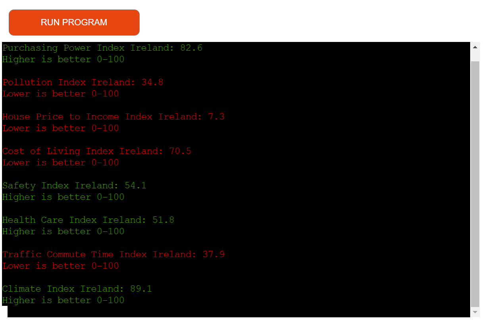

#### Ask user if they want to select another Country

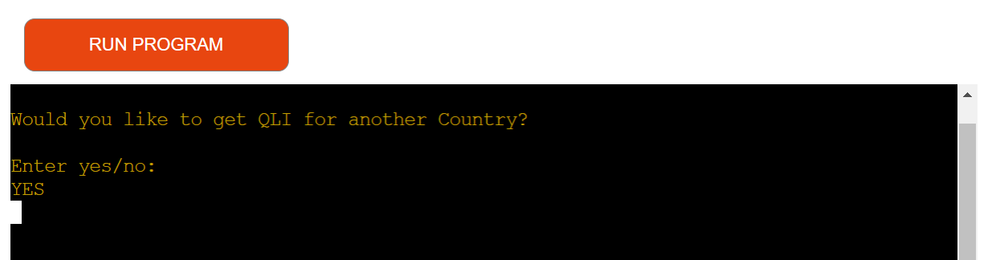

#### End of application & Copyrights

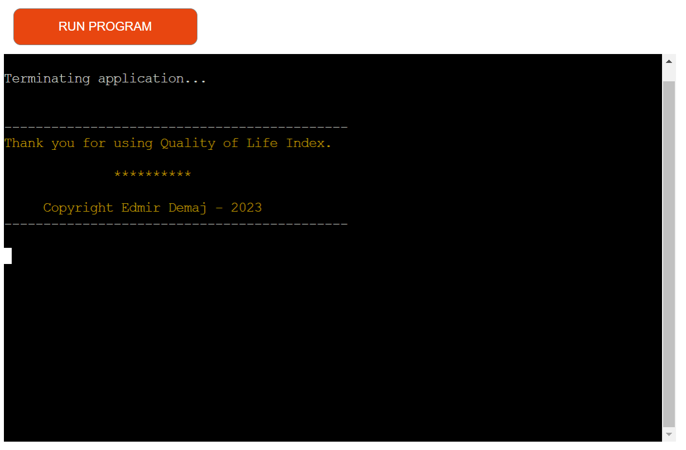

---

## Future Features

- Provide an option to compare Countries between each other wich has better quality of life.
- Expand data with Cities from different Countries.
- Provide an option to compare Cities between each other wich has better quality of life.

---

## Testing & Validation

- Several manual testings are done to the application to check the funcionality and everything works perfectly as wanted.
- All inputs are tested with different inpute values.
- All input validations work perfectly providing clear error message to user when input values are incorrect.
- Code has been validated with [CI Python Linter](https://pep8ci.herokuapp.com/) and no errors/warnings were found.
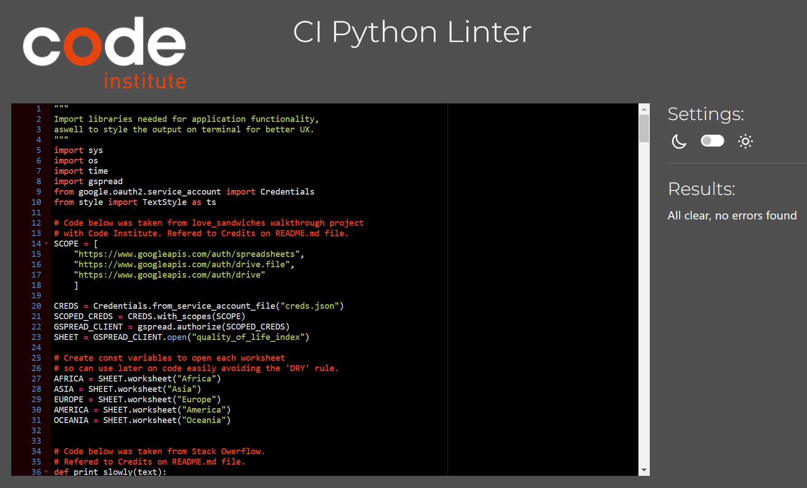

---

## Bugs 

All bugs are fixed, there are no bugs left to fix.

---

## Deployment

This application has been deployed by using the [Heroku](https://www.heroku.com). This project utilizes the services available at Heroku cloud platform. Heroku is a platform that allows users to build, deploy, and control applications in a cloud environment.

To deploy the project on Heroku steps followed are listed below:

- Create an account with [Heroku](https://www.heroku.com).
- Select *New* in the top-right corner of your Heroku Dashboard after log-in.
- Select *Create new app* button from the dropdown menu and select it.
- Assign a unique name to your application.
- Navigate to the *region* dropdown menu and select the region closest to you from either EU or USA. 
- Select *Create App*.
- Open your created application and select *Settings*. 
- Click *Reveal Config Vars*.
- Add first *Config Var*.
- Set the value of KEY to `CREDS`, copy and paste the data in your credentials file (ie. creds.json) into the value area.
- Add second *Config Var*.
- Set the value of KEY to `PORT`, and the value to `8000` then select *add*.
- You need to add support to dependencies to be able to successfully deploy application, select *Add Buildpack*.
- The order in which you list your dependencies is important, select `Python` as the first dependency.
- From the same menu, select `Node.js` after you select `Python`. (You can drag the list items upwards and downwards to change their order if needed.)
- Go back to `Deploy` section and select deployed method `GitHub`.
- Click search button and write the name of your project from GitHub.
- Scroll down till the end and select `Enable Automatic Deploy` to rebuild your project automatically every time you push a new commit. Select  `Deployment` to manually deploy from your desired branch on will.*

---

## Technologies Used

- Google Chrome: main browser used for development and testing.
- Microsoft Edge: browser used for testing the deployed site.
- Mozilla Firefox: browser used for testing the deployed site.
- Safari: browser used for testing the deployed site.
- Opera: browser used for testing the deployed site.
- Ascii-art-generator: website to generate logo as banner.
- Python: to built application.
- GitHub: version control and site deployment.
- GitPod: Integrated Development Environment (IDE), where write the code.
- Coolors: for creating a matching colour palette that has appropriate contrast.
- Google Cloud: for accessing a library of Google-based API services.
- Google Drive API: for communicating with a cloud service to upload data.
- Google Sheets API: for reading and writing automated data to a cloud-hosted spreadsheet file.
- Lucidchart: to built flowchart for project idea.
- Heroku: to deploy on a cloud platform the application.

### Libraries
- [os](https://docs.python.org/3/library/os.path.html) - Used to clear terminal.
- [sys, time, sleep](https://www.geeksforgeeks.org/sleep-in-python/) - Used to create a typing effect in print statments in the app.
- [colorama](https://pypi.org/project/colorama/)- Used to provide colour to the text used in the application to provide visual stimulation.
- [gspread](https://docs.gspread.org/en/latest/user-guide.html#cell-object) - Used to get data from a cloud-based database as vanilla Python doesnt have this functionality.
- [google oauth2](https://google-auth.readthedocs.io/en/stable/reference/google.oauth2.html) - Used to access Google APIs to connect two applications to exchange data.

---

## Credits & References

- All data used in Google spreadsheet was taken from [Numbeo](https://www.numbeo.com/cost-of-living/)
- The `Love Sandwiches` walkthrough project with [Code Institute](https://codeinstitute.net/)  was used to learn how to connect to Google Drive and Google Spreadsheets API services, how to define scope in the code in regards to API, connecting Python code with cloud platforms to upload and pull data and deployment to Heroku.
- [W3Schools](https://www.w3schools.com/) : is used to help with Python3 validations, and string methods manipulations.
- [Stack Overflow](https://stackoverflow.com/) : is used to fix bugs during development process.
    - Is used to [simulate typing speed](https://stackoverflow.com/questions/4099422/printing-slowly-simulate-typing)
    - Is used to [clean the terminal](https://stackoverflow.com/questions/517970/how-to-clear-the-interpreter-console)

- [gspread](https://docs.gspread.org/en/latest/user-guide.html#cell-object) : is used to learn how to access different cells and rows on a worksheet from Python.

---

## Acknowledgements

I would like to thank [Code Institute](https://codeinstitute.net/) for their support and guidance throughout the development of this project.

I would like to thank my mentor [Jubril Akolade](https://www.linkedin.com/in/jubrillionaire/?originalSubdomain=ng) for his continuos support, advices and feebacks on my project. 

Last but not least important would like to thank myself, [Edmir Demaj](https://www.linkedin.com/feed/), for all the hard an amazing job done, for long hours writting code and solving problems.

---

# Thank you !
 [Back to Top](#table-of-contents)